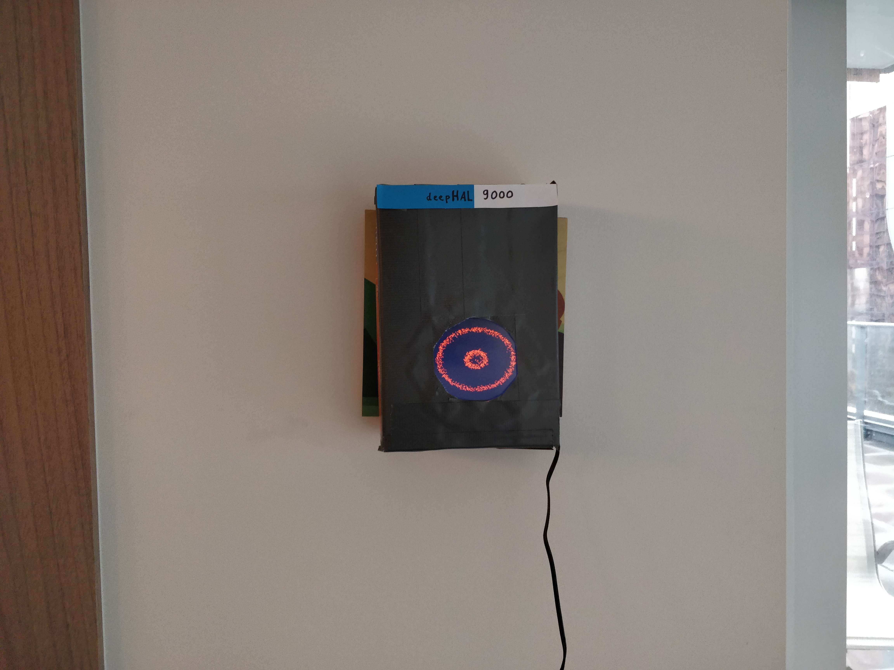

# Deep Face
Deep Face is giving a face to AI systems. Inspired by A Space Odyssey's HAL 9000
and the Eye of Sauron (LOTR), the eye of the AI is made out of tiny
particles swarming around, together forming the pupil and eye contours.
The particles will react to sound, touch, and other events, and will resemble
emotions as experienced by the AI and surrounding system Deep Face is integrated in.
Of course, none of these emotions are real. But what do these simple humans know?

Features include:

- Eye simulation based on thousands of particles
- Runs on a Raspberry Pi (3 B+) or other ARM boards or computers
- Reacts to touch and mouse
- Reacts to sound
- MQTT API (and keyboard shortcuts) to control entropy (excitement) and colour (emotion)


## Hardware
This repository is tested on:
1. Ubuntu 18.04 on x64
2. Raspberry Pi 3 B+ with Raspbian 9, and
   - USB microphone
   - HDMI Touchscreen (5 inch)


## Installation
- Install OpenFrameworks into ~/software/openframeworks/;
  - To get rid of Poco compile errors, I had to recompile Poco with apothecary (an OFX specific build system):
  ```
  git clone https://github.com/openframeworks/apothecary.git && cd apothecary
  ./apothecary/apothecary update poco
  cp poco/ $OF_ROOT/addons/ofxPoco/libs/ -r
  ```

- Set $OF_ROOT to ~/software/openframeworks in .profile / .bashrc / .zshrc

- Install addons: run `./install_dependencies.sh`, or install manually to `$OF_ROOT/addons`:
    - Install [ofxRPiTouch](https://github.com/turiphro/ofxRPiTouch)
    - Install [ofxMQTT](https://github.com/256dpi/ofxMQTT.git)

- `make && make RunRelease`


### Additional installation for raspberry pi
- Configure touchscreen: [[https://www.raspberrypi.org/forums/viewtopic.php?t=143581]]
- Most USB microphones will work out of the box
- Add a USB webcam for evil eye tracking WHAHAHA (rpi onboard camera not supported yet)


## More info
<https://turiphro.nl/projects/deep-face>


